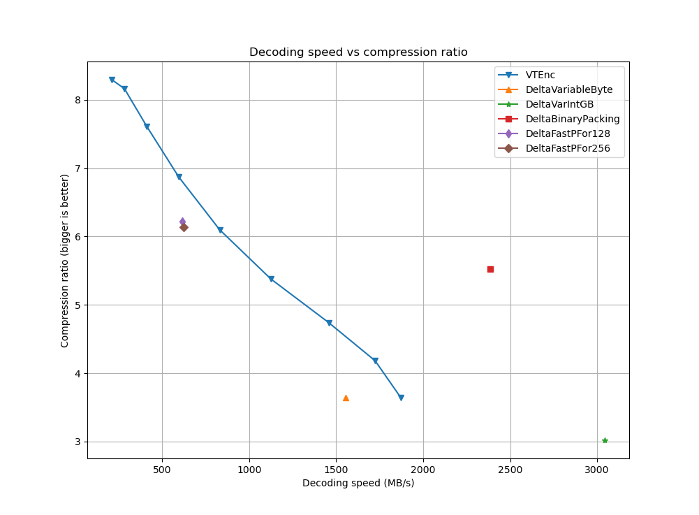
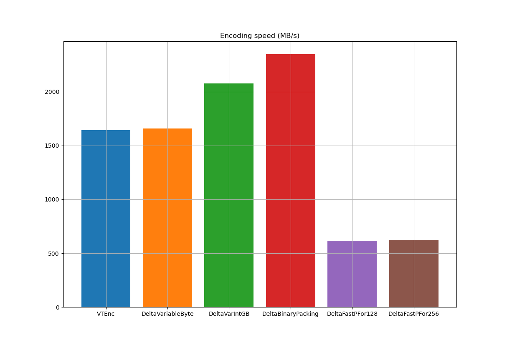
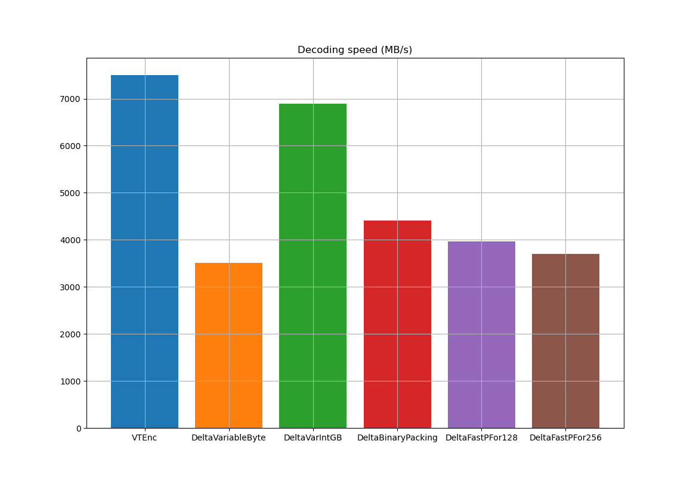

# VTEnc

[VTEnc](https://vteromero.github.io/2019/07/28/vtenc.html) is a compression algorithm for sorted lists of unsigned integers. This C library provides an interface to use VTEnc with sequences of various data types (8, 16, 32 and 64 bits).

**WARNING: This project is in its initial stages of development and might dramatically change on each version. Have a look at the [Development philosophy](https://github.com/vteromero/VTEnc#development-philosophy) section to understand the rationale behind it.**

## Results

*This is a work-in-progress section. Last updated on: 2022-03-01*

For reference, VTEnc has been tested on a laptop Ubuntu Desktop 21.10 with a Core i7-6700HQ CPU @ 2.60GHz x 8, using different data sets and comparing it with other integer compression algorithms. See [Tests](https://github.com/vteromero/VTEnc#tests) and [Benchmarks](https://github.com/vteromero/VTEnc#benchmarks) below for further information.

* `gov2.sorted`:

 |  |  |
 |  |  |
 |:---:|:---:|

 _(\*) VTEnc's results on "speed vs ratio" charts are for the following values of the encoding parameter `min_cluster_length`: 1, 2, 4, 8, 16, 32, 64, 128 and 256._
 _(\*\*) VTEnc's results on "speed" charts are for `min_cluster_length` = 256._

* Timestamps (`ts.txt`):

 |  |  |
 |:---:|:---:|

## API

The documented interface is found in the header file `vtenc.h`.

## Example

```c
#include <stddef.h>
#include <stdint.h>
#include <stdio.h>
#include <stdlib.h>
#include <string.h>

#include "vtenc.h"

int encode(
  vtenc *handler,
  const uint8_t *values,
  size_t values_len,
  uint8_t **out,
  size_t *out_len)
{
  const size_t out_cap = vtenc_max_encoded_size8(values_len); /* output capacity */
  int rc;

  *out = (uint8_t *) malloc(out_cap * sizeof(uint8_t));
  if (*out == NULL) {
    fprintf(stderr, "allocation error\n");
    return 0;
  }

  rc = vtenc_encode8(handler, values, values_len, *out, out_cap);
  if (rc != VTENC_OK) {
    fprintf(stderr, "encode failed with code: %d\n", rc);
    return 0;
  }

  *out_len = vtenc_encoded_size(handler);

  return 1;
}

int decode(
  vtenc *handler,
  const uint8_t *in,
  size_t in_len,
  uint8_t **out,
  size_t out_len)
{
  int rc;

  *out = (uint8_t *) malloc(out_len * sizeof(uint8_t));
  if (*out == NULL) {
    fprintf(stderr, "allocation error\n");
    return 0;
  }

  rc = vtenc_decode8(handler, in, in_len, *out, out_len);
  if (rc != VTENC_OK) {
    fprintf(stderr, "decode failed with code: %d\n", rc);
    return 0;
  }

  return 1;
}

int main()
{
  const uint8_t values[] = {13, 14, 29, 39, 65, 80, 88, 106, 152, 154, 155, 177};
  const size_t values_len = sizeof(values) / sizeof(values[0]);
  uint8_t *enc_out=NULL, *dec_out=NULL;
  size_t enc_out_len;
  int rc = 0;
  vtenc *handler = vtenc_create();

  if (handler == NULL) {
    fprintf(stderr, "It failed to create the handler\n");
    return 1;
  }

  if (!encode(handler, values, values_len, &enc_out, &enc_out_len)) {
    rc = 1;
    goto free_and_return;
  }

  if (!decode(handler, enc_out, enc_out_len, &dec_out, values_len)) {
    rc = 1;
    goto free_and_return;
  }

  printf("Original list: %lu bytes\n", values_len);
  printf("Encoded stream: %lu bytes\n", enc_out_len);

  if (memcmp(values, dec_out, values_len) == 0) {
    printf("Decoded output matches original list\n");
  } else {
    printf("Decoded output different from original list\n");
    rc = 1;
  }

free_and_return:
  if (enc_out != NULL)
    free(enc_out);

  if (dec_out != NULL)
    free(dec_out);

  vtenc_destroy(handler);

  return rc;
}

```

## Limitations

For now, this library has only been tested on Linux and MacOS systems. It shouldn't be too difficult to support Windows as well and I'm planing to do so in future releases.

## Building

To compile the library, run `make` in root directory. That will generate the static and the shared libraries (`.a` and `.so` files), ready to be included in your own projects.

## Tests

This library is well covered with unit tests and with a few little programs to test different data sets. To build both the programs and the unit tests, run `make test` in the root directory. The following executable files will be created:

* `tests/unit/unit_tests`: invoke it to run all the unit tests.

* `tests/testrand.sh`: script to test all the random sequences located on `tests/data` directory. For each file, it calls `tests/testbinseq` program, which tests the serialised list or set "end-to-end", by encoding and decoding it and then comparing the result with the original sequence.

* `tests/timestamps`: program to test [ts.txt](https://github.com/zentures/encoding/tree/master/benchmark/data), a text file with a big list of timestamps.

* `tests/gov2`: program to test [gov2.sorted](https://lemire.me/data/integercompression2014.html) file, which is part of the "Document identifier data set" created by [D. Lemire](https://lemire.me/en/).

## Benchmarks

The tables shown in the [Results](https://github.com/vteromero/VTEnc#results) section are the result of running the tests included in the [integer-compression-benchmarks](https://github.com/vteromero/integer-compression-benchmarks) repository.

## Development philosophy

This section describes the rules and guidelines that will be followed in the different phases of development. Specifically, it explains the versioning philosophy in the two well-differentiated stages: before and after version 1.0.0 (first stable version).

#### Versions 0.X.Y

The main focus at this stage is to find the right **encoded format** that maximises compression ratio, encoding speed and decoding speed. Ideally, the format should also be open to support new features in future versions.

Given a version *0.X.Y*, changes on:

* *X* means either breaking changes or new functionality.
* *Y* means bug fixes or performance improvements.

Backward compatibility is not a priority here.

#### From version 1.0.0

Versions will follow [SemVer](https://semver.org/) scheme, i.e. given a version *X.Y.Z*, incrementing:

* *X* means that the library introduces breaking changes.
* *Y* means that the library adds new functionality with backward compatibility.
* *Z* means that the library adds bug fixes or performance improvements.

Stability, security and backward compatibility will be a priority starting at version v1.0.0.

## License

This code is licensed under MIT license.
